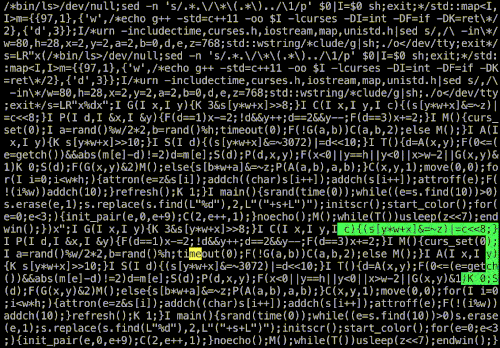

# quinesnake
A quine that plays snake over its own source!

### How to run it
The program compiles itself; to run it first make the source file executable
(`chmod +x quinesnake.cpp`), then run it with `./quinesnake.cpp`. It invokes
`g++` on itself and then starts the game.

The snake is controlled with `w`, `a`, `s` and `d`.

### quinesnake.cpp
This is the quine version that also compiles itself and plays snake over its
own source. It requires:
- libcurses
- Some binary called `g++` needs to exist (tested with GCC and Clang)
- `/bin/ls` needs to exist and be executable

### quinesnake-commented.cpp
This version of the program isn't a quine and doesn't compile itself, but it
has all of the basic game-playing logic that the real version has, plus it's
commented and readable.